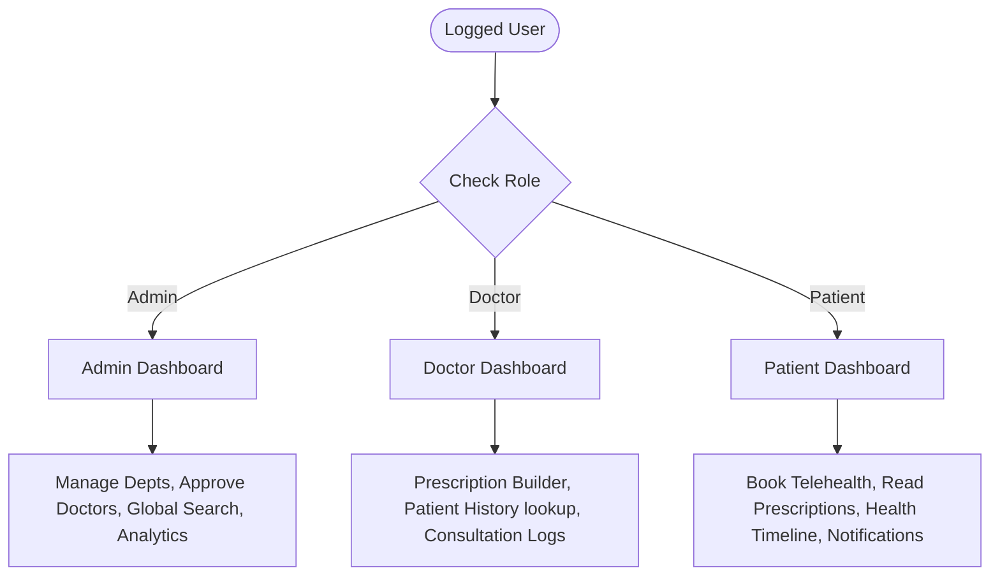
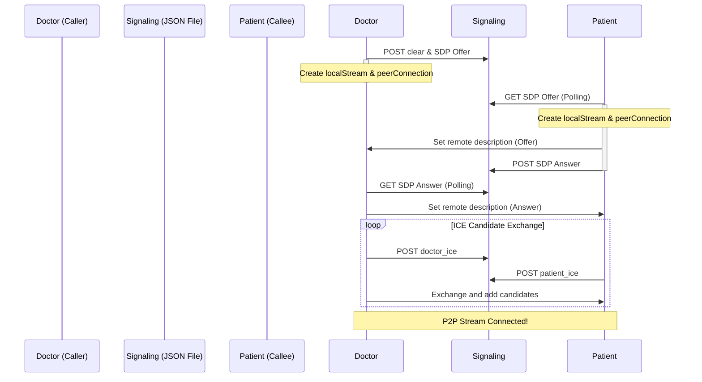

# Medicare Smart Hospital Management System (HMS) - Full Documentation

Medicare is a state-of-the-art Django-based Smart Hospital Management System (HMS). The platform delivers a modern, mobile-responsive telehealth dashboard and incorporates an intelligent AI medical assistant, a peer-to-peer WebRTC video calling module, and advanced role-based analytics.

---

## 1. System Architecture & Technologies

The platform is designed to run efficiently in containerized environments (such as Docker) and deploy seamlessly to production hosts like Hugging Face Spaces.

### Core Stack
* **Framework**: Django 5.1.4 (MVC Architecture)
* **REST API**: Django REST Framework (DRF) 3.15.2
* **Database**: SQLite 3 (Development) / PostgreSQL compatible (Production)
* **WSGI Server**: Gunicorn 23.0.0
* **Static Assets**: WhiteNoise 6.8.2
* **Styling**: Vanilla CSS (CSS Variables Design System)
* **Icons**: FontAwesome 6.4.0 CDN
* **Fonts**: Google Fonts (Outfit, Inter)

### AI & Machine Learning Stack
* **Deep Learning**: TensorFlow 2.21.0 & Keras 3.14.1
* **Analytics**: Pandas, NumPy, SciPy, Scikit-learn
* **Embeddings**: Sentence-Transformers 3.4.1

---

## 2. Model Schema & Database Layer

### Core Models

#### `CustomUser` (authentication app)
Extends Django’s base `AbstractUser` to support role classification.
* `role`: `CharField` (`patient`, `doctor`, `admin`)
* `profile_image`: `ImageField`
* `phone`: `CharField`

#### `DoctorProfile` (doctors app)
* `user`: `OneToOneField` to `CustomUser`
* `doctor_id`: `CharField` (Unique, auto-generated random 3-digit ID prefixed with "D", e.g., `D101`)
* `department`: `ForeignKey` to `Department`
* `specialization`, `qualification`: `CharField`
* `experience`: `IntegerField` (Years of experience)
* `consultation_fee`: `DecimalField`
* `available_days`: `CharField` (e.g., "Mon, Wed, Fri")
* `is_online`: `BooleanField` (Tracks live status)
* `is_approved`: `BooleanField` (Admin approval state)
* `rating`: `FloatField` (Default `4.5`)
* `reviews`: `IntegerField`

#### `PatientProfile` (patients app)
* `user`: `OneToOneField` to `CustomUser`
* `patient_id`: `CharField` (Unique, auto-generated random 3-digit ID prefixed with "P", e.g., `P205`)
* `medical_history`: `TextField`

#### `Appointment` (appointments app)
* `appointment_id`: `CharField` (Unique, auto-generated 4-digit ID)
* `patient`: `ForeignKey` to `PatientProfile`
* `doctor`: `ForeignKey` to `DoctorProfile`
* `appointment_date`: `DateField`
* `appointment_time`: `TimeField`
* `status`: `CharField` (`Pending`, `Approved`, `Scheduled`, `Completed`, `Cancelled`)
* `reason`: `TextField`
* `consultation_type`: `CharField` (`Video`, `Audio`, `In-Person`)
* `call_session_status`: `CharField` (`idle`, `ringing`, `active`, `ended`)

#### `Department` (departments app)
* `name`: `CharField`
* `description`: `TextField`
* `icon`: `CharField` (FontAwesome class name)

---

## 3. User Roles & Dashboard Features

The system adapts dynamically depending on the logged-in user's role:



### Admin Dashboard
* **Statistics Overview**: Real-time display of total doctors, total patients, total appointments, total prescriptions, pending appointments count, and report uploads.
* **Doctor Approval Panel**: Active list of pending doctor profiles. Admins can click "Approve" to activate their profiles, granting them permission to appear in department lists and receive patient bookings.
* **Department Management**: Management forms to add, edit, or delete medical departments and configure their representative icons.
* **Global Search Engine**: Responsive navbar search bar allowing admins to query doctors, patients, or appointments across the entire system.
* **Monthly Trends Chart**: Visually summarizes appointment volume trends using Chart.js.

### Doctor Dashboard
* **Appointment Tracking**: Display of upcoming, pending, and completed consultations.
* **Patient History Lookup**: Secure search bar that allows doctors to lookup any patient's files (ID or name) to check medical records, upload dates, and previous prescriptions.
* **Prescription builder**: Interface to create, modify, and assign prescriptions directly.
* **Profile Manager**: Form to update specialization, available hours, and fees.

### Patient Dashboard
* **Booking System**: Step-by-step scheduler to book video, audio, or in-person consultations with approved doctors.
* **Health Timeline**: Chronological log of diagnostic reports and prescriptions.
* **Notifications Bell**: Dropdown notification list detailing status updates for requested appointments (approved, rejected, or completed).
* **Patient Search**: Search bar to query active records, prescriptions, or symptoms.

---

## 4. Intelligent AI Health Assistant Portal

The **MediCore AI Health Assistant** serves as a smart interface bridging patient symptoms and hospital records. 

### Core Mechanics
* **Symptom Mapping**: An internal analyzer maps natural language descriptions to medical specialties:
  * *Chest pain / breathing issues* $\to$ Cardiology
  * *Skin allergy / rash* $\to$ Dermatology
  * *Eye irritation / vision* $\to$ Ophthalmology
  * *Diabetes / hormone* $\to$ Endocrinology
  * *Back pain / fractures* $\to$ Orthopedics
  * *Stress / anxiety* $\to$ Psychiatry
* **In-Chat Booking**: Renders direct interactive appointment scheduling cards inside the conversation viewport if the patient wants to book the recommended doctor.
* **Doctor ID / Patient ID Lookup**:
  * If a Doctor requests a patient ID (e.g. `P205`), the AI displays the patient profile card.
  * Patients querying matching doctor IDs (e.g. `D101`) receive the doctor's details and active booking buttons.
* **Chat segregation (Security Model)**: Conversation sessions are partitioned strictly by `CustomUser` and the active dashboard role (`assistant_role=request.user.role`). Chat history access is locked via server-side middleware checking ownership. Any cross-role session ID hijacking attempts result in `403 Forbidden` responses.

---

## 5. WebRTC Telehealth Video Calling Module

Medicare features a peer-to-peer WebRTC video calling pipeline that connects doctor and patient screens directly.



### Telehealth Workflow
1. **Initiation**: The Doctor clicks "Start Video Call" from an approved appointment detail page, setting the session status to `ringing`. The Patient receives an incoming call alert popup with a button to join.
2. **Signaling Mechanism**: Built using standard JSON-file based polling in `/webrtc_signaling/{appointment_id}.json` to make communication fast and stateless:
   * **Doctor (Caller)**: Resets the signaling file, initiates `RTCPeerConnection` with local camera/mic stream, generates SDP Offer, and writes it to signaling. It then polls for the SDP Answer.
   * **Patient (Callee)**: Polls for the SDP Offer, configures remote description, generates SDP Answer, and writes it to signaling.
   * **Candidate Gathering**: Both peers continuously write local ICE candidates to `doctor_ice` and `patient_ice` lists and read the other peer's candidates to establish connection channels.
3. **Hardware Fallback**: If a camera is blocked, headless, or running on non-SSL environments, the client automatically mounts a Canvas mock video stream. This generates a moving radar profile that carries active video track data across WebRTC peer connection pipelines, allowing testing to succeed.
4. **Call UI Controls**: Include buttons to toggle local audio/mic, toggle video camera, switch front/rear cameras, activate browser-native Picture-in-Picture (PiP), and trigger a hang-up beacon to terminate sessions.

---

## 6. Mobile Responsiveness Design System

All dashboards and components utilize CSS Variables and responsive breakpoints to guarantee compatibility across mobile viewports:

* **Grid Stacking**: CSS rule overrides force three-column statistical indicators (`.stats-section`) and analytical grids to wrap into vertical stacked columns (`grid-column: span 1 !important`) on screens `<= 768px`.
* **Sidebar Drawer**: On mobile widths (`<= 768px`), the navigation sidebar collapses off-screen. Clicking the menu icon in the dashboard header slides it out, and clicking the overlay backdrop slides it closed.
* **Specialists Online Dotted Box**: Layout issues have been resolved by configuring the empty-list dotted box to use `grid-column: 1 / -1;`, guaranteeing it scales to fit 100% of the screen width.
* **Notification Bell Dropdown**: The dropdown uses `max-width: calc(100vw - 32px);` and a responsive padding reset (`right: -10px`) to prevent overflows on mobile.

---

## 7. Developer Guide & Setup Instructions

### Local Environment Setup

1. **Clone the Repository**:
   ```bash
   git clone <repository_url>
   cd "smart hospital management system"
   ```

2. **Activate Virtual Environment**:
   * Windows:
     ```powershell
     .\venv\Scripts\Activate.ps1
     ```
   * macOS/Linux:
     ```bash
     source venv/bin/activate
     ```

3. **Install Dependencies**:
   ```bash
   pip install -r requirements.txt
   ```

4. **Run Database Migrations**:
   ```bash
   python hospital_management_system/manage.py migrate
   ```

5. **Start Development Server**:
   ```bash
   python hospital_management_system/manage.py runserver
   ```
   *The local server runs at [http://127.0.0.1:8000/](http://127.0.0.1:8000/).*

### Git & Hugging Face Deployment Flow

1. **Add & Commit**:
   ```bash
   git add .
   git commit -m "Your description of edits"
   ```
2. **Deploy to GitHub**:
   ```bash
   git push origin master:main
   ```
3. **Deploy to Hugging Face Space**:
   ```bash
   git push hf master:main
   ```
4. **Post-Deployment rebuild**: Go to Hugging Face Spaces settings panel, click "Factory Reset", and verify container build success.
